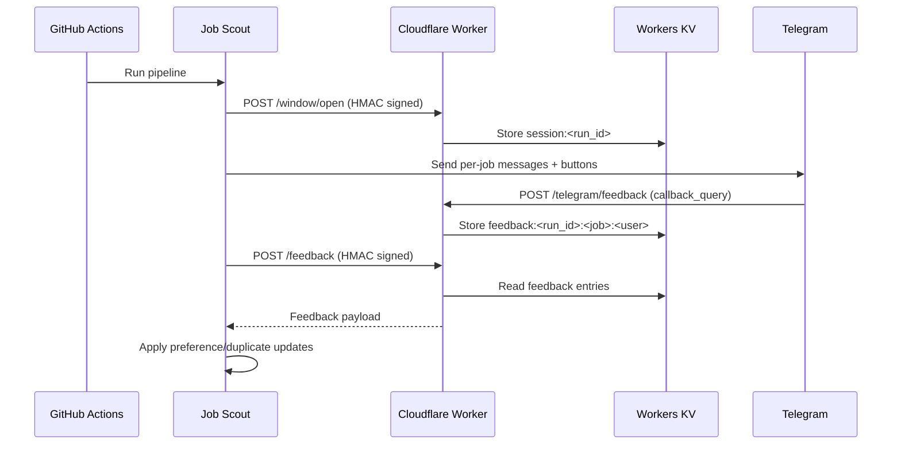

```mermaid
sequenceDiagram
    participant GA as GitHub Actions
    participant JS as Job Scout
    participant CF as Cloudflare Worker
    participant KV as Workers KV
    participant TG as Telegram

    GA->>JS: Run pipeline
    JS->>CF: POST /window/open (HMAC signed)
    CF->>KV: Store session:<run_id>
    JS->>TG: Send per-job messages + buttons
    TG->>CF: POST /telegram/feedback (callback_query)
    CF->>KV: Store feedback:<run_id>:<job>:<user>
    JS->>CF: POST /feedback (HMAC signed)
    CF->>KV: Read feedback entries
    CF-->>JS: Feedback payload
    JS->>JS: Apply preference/duplicate updates
```
